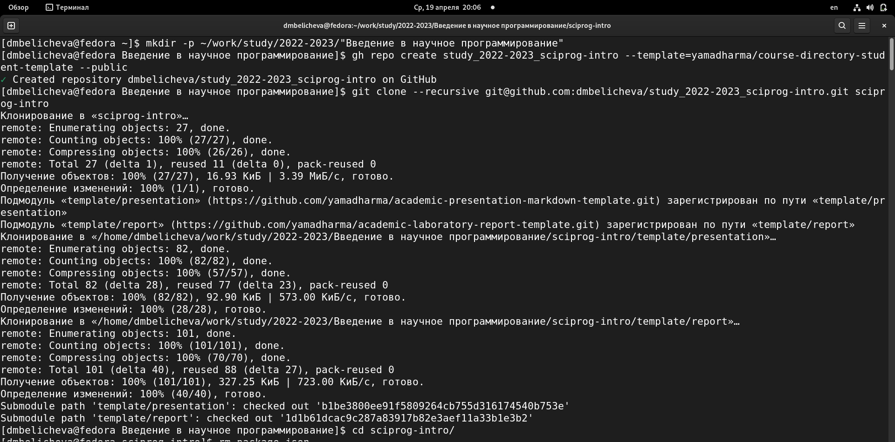
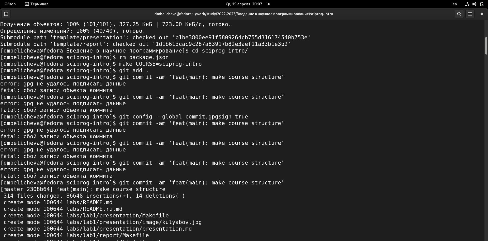
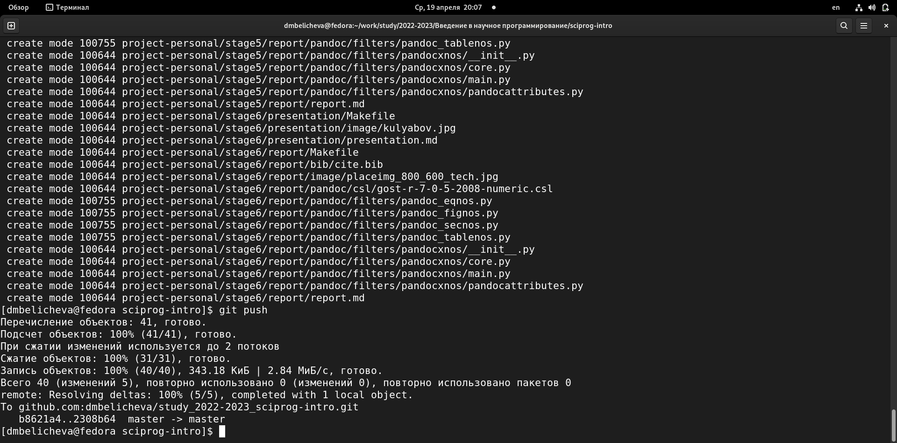
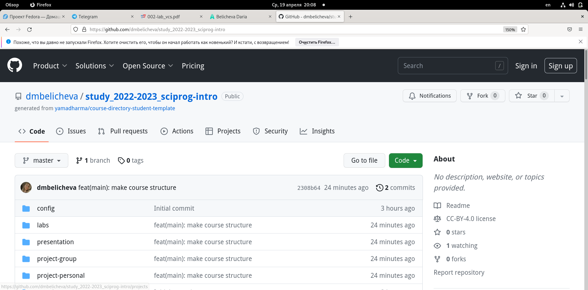

---
## Front matter
lang: ru-RU
title: Лабораторная работа №1
subtitle: Управление версиями
author:
  - Беличева Д. М.
institute:
  - Российский университет дружбы народов, Москва, Россия
date: 05 декабря 2003

## i18n babel
babel-lang: russian
babel-otherlangs: english

## Formatting pdf
toc: false
toc-title: Содержание
slide_level: 2
aspectratio: 169
section-titles: true
theme: metropolis
header-includes:
 - \metroset{progressbar=frametitle,sectionpage=progressbar,numbering=fraction}
 - '\makeatletter'
 - '\beamer@ignorenonframefalse'
 - '\makeatother'
---

# Информация

## Докладчик

:::::::::::::: {.columns align=center}
::: {.column width="70%"}

  * Беличева Дарья Михайловна
  * студент
  * Российский университет дружбы народов
  * [1032216453@pfur.ru](mailto:1032216453@pfur.ru)
  * <https://dmbelicheva.github.io/ru/>

:::
::: {.column width="25%"}

:::
::::::::::::::

## Цель работы
 
- Вспомнить умения по работе с git.
- Создать необходимый каталог для курса.

## Задание

    1. Зарегистрироваться на Github;
    2. Создать базовую конфигурацию для работы с git;
    3. Создать ключ SSH;
    4. Создать ключ PGP;
    5.  Настроить подписи git;
    6. Создать локальный каталог для выполнения заданий по предмету.

## Теоретическое введение

В этой лабораторной работе мы познакомимся с системами контроля версий. Системы контроля версий (Version Control System, VCS) применяются при работе нескольких человек над одним проектом. 
Обычно основное дерево проекта хранится в локальном или удалённом репозитории, к которому настроен доступ для участников проекта. 
При внесении изменений в содержание проекта система контроля версий позволяет их фиксировать, совмещать изменения, произведённые разными участниками проекта, производить откат к любой более ранней версии проекта, если это требуется. Существуют классические и распределенные системы контроля версий (РСКВ). Сегодня мы будем работать с распределенной VSC – Git.

## Теоретическое введение

В РСКВ (таких как Git, Mercurial, Bazaar или Darcs) клиенты не просто скачивают снимок всех файлов - они полностью копируют репозиторий. В этом случае, если один из серверов, через который разработчики обменивались данными, умрёт, любой клиентский репозиторий может быть скопирован на другой сервер для продолжения работы. 
Каждая копия репозитория является полным бэкапом всех данных.
Более того, многие РСКВ могут одновременно взаимодействовать с несколькими удалёнными репозиториями, благодаря этому вы можете работать с различными группами людей, применяя различные подходы единовременно в рамках одного проекта. Это позволяет применять сразу несколько подходов в разработке, например, иерархические модели, что совершенно невозможно в централизованных системах.

## Выполнение лабораторной работы

Выполнение 1-5 пунктов было осуществлено еще на 1 курсе на предмете "Операционные системы", поэтому мне осталось только создать новый каталог.

№6

Необходимо создать шаблон рабочего пространства.

{ #fig:001 width=50% }

## Выполнение лабораторной работы

Перейдем в каталог курса. Удалим лишние файлы. Создадим необходимые каталоги. Отправим файлы на сервер.

{ #fig:002 width=70% }

## Выполнение лабораторной работы

Отправляем  файлы на сервер.

{ #fig:003 width=70% }

## Выполнение лабораторной работы

{ #fig:004 width=80% }

## Выводы

Вспомнила средства контроля версий и их применение. Создала новый каталог, подключила репозиторий, добавила и удалила необходимые файлы.

## {.standout}

Спасибо за внимание

