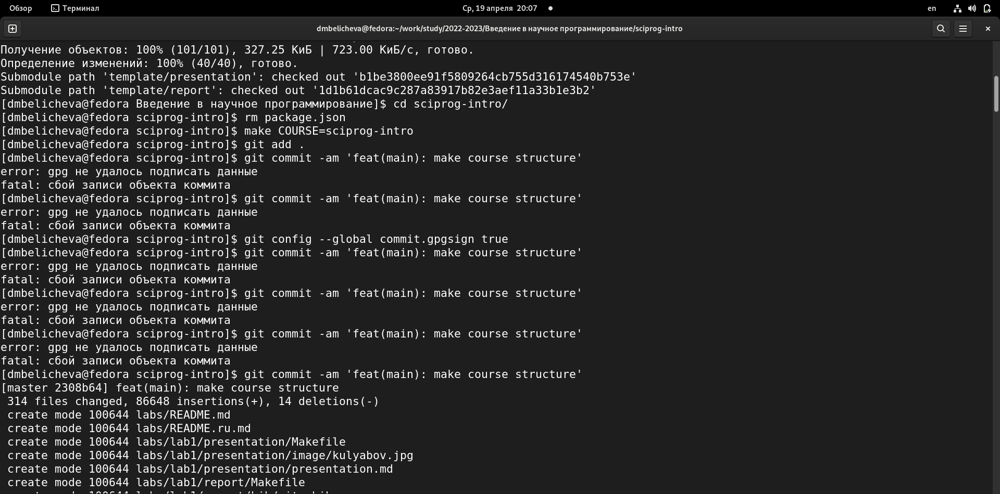

---
## Front matter
title: "Лабораторная работа №1"
subtitle: "Управление версиями"
author: "Беличева Дарья Михайловна"

## Generic otions
lang: ru-RU
toc-title: "Содержание"

## Bibliography
bibliography: bib/cite.bib
csl: pandoc/csl/gost-r-7-0-5-2008-numeric.csl

## Pdf output format
toc: true # Table of contents
toc-depth: 2
lof: true # List of figures
lot: false # List of tables
fontsize: 12pt
linestretch: 1.5
papersize: a4
documentclass: scrreprt
## I18n polyglossia
polyglossia-lang:
  name: russian
  options:
	- spelling=modern
	- babelshorthands=true
polyglossia-otherlangs:
  name: english
## I18n babel
babel-lang: russian
babel-otherlangs: english
## Fonts
mainfont: PT Serif
romanfont: PT Serif
sansfont: PT Sans
monofont: PT Mono
mainfontoptions: Ligatures=TeX
romanfontoptions: Ligatures=TeX
sansfontoptions: Ligatures=TeX,Scale=MatchLowercase
monofontoptions: Scale=MatchLowercase,Scale=0.9
## Biblatex
biblatex: true
biblio-style: "gost-numeric"
biblatexoptions:
  - parentracker=true
  - backend=biber
  - hyperref=auto
  - language=auto
  - autolang=other*
  - citestyle=gost-numeric
## Pandoc-crossref LaTeX customization
figureTitle: "Рис."
tableTitle: "Таблица"
listingTitle: "Листинг"
lofTitle: "Список иллюстраций"
lotTitle: "Список таблиц"
lolTitle: "Листинги"
## Misc options
indent: true
header-includes:
  - \usepackage{indentfirst}
  - \usepackage{float} # keep figures where there are in the text
  - \floatplacement{figure}{H} # keep figures where there are in the text
---

# Цель работы
 
- Вспомнить умения по работе с git.
- Создать необходимый каталог для курса.

# Задание

    1. Зарегистрироваться на Github;
    2. Создать базовую конфигурацию для работы с git;
    3. Создать ключ SSH;
    4. Создать ключ PGP;
    5.  Настроить подписи git;
    6. Создать локальный каталог для выполнения заданий по предмету.

# Теоретическое введение

В этой лабораторной работе мы познакомимся с системами контроля версий. Системы контроля версий (Version Control System, VCS) применяются при работе нескольких человек над одним проектом. 
Обычно основное дерево проекта хранится в локальном или удалённом репозитории, к которому настроен доступ для участников проекта. 
При внесении изменений в содержание проекта система контроля версий позволяет их фиксировать, совмещать изменения, произведённые разными участниками проекта, производить откат к любой более ранней версии проекта, если это требуется. Существуют классические и распределенные системы контроля версий (РСКВ). Сегодня мы будем работать с распределенной VSC – Git.
В РСКВ (таких как Git, Mercurial, Bazaar или Darcs) клиенты не просто скачивают снимок всех файлов - они полностью копируют репозиторий. В этом случае, если один из серверов, через который разработчики обменивались данными, умрёт, любой клиентский репозиторий может быть скопирован на другой сервер для продолжения работы. 
Каждая копия репозитория является полным бэкапом всех данных.
Более того, многие РСКВ могут одновременно взаимодействовать с несколькими удалёнными репозиториями, благодаря этому вы можете работать с различными группами людей, применяя различные подходы единовременно в рамках одного проекта. Это позволяет применять сразу несколько подходов в разработке, например, иерархические модели, что совершенно невозможно в централизованных системах. [@VCS:bash]

# Выполнение лабораторной работы

Выполнение 1-5 пунктов было осуществлено еще на 1 курсе на предмете "Операционные системы", поэтому мне осталось только создать новый каталог.

№6

Необходимо создать шаблон рабочего пространства. (рис. [-@fig:001])

{ #fig:001 width=70% }

Перейдем в каталог курса. Удалим лишние файлы. Создадим необходимые каталоги. Отправим файлы на сервер. (рис. [-@fig:002]) 

{ #fig:002 width=70% }

Отправляем  файлы на сервер. (рис. [-@fig:003;-@fig:004]) 

{ #fig:003 width=70% }

{ #fig:004 width=70% }

# Выводы

Вспомнила средства контроля версий и их применение. Создала новый каталог, подключила репозиторий, добавила и удалила необходимые файлы.

# Ответы на контрольные вопросы
1. Что такое системы контроля версий (VCS) и для решения каких задач они предназначаются?
Система контроля версий — программное обеспечение для облегчения работы с изменяющейся информацией. Система управления версиями позволяет хранить несколько версий одного и того же документа, при необходимости возвращаться к более ранним версиям, определять, кто и когда сделал то или иное изменение, и многое другое.
Системы контроля версий (Version Control System, VCS) применяются для:
    • Хранение полной истории изменений 
    • причин всех производимых изменений 
    • Откат изменений, если что-то пошло не так 
    • Поиск причины и ответственного за появления ошибок в программе 
    • Совместная работа группы над одним проектом 
    • Возможность изменять код, не мешая работе других пользователей

2. Объясните следующие понятия VCS и их отношения: хранилище, commit, история, рабочая копия. 
Репозиторий - хранилище версий - в нем хранятся все документы вместе с историей их изменения и другой служебной информацией. 
Commit — отслеживание изменений, сохраняет разницу в изменениях
Рабочая копия - копия проекта, связанная с репозиторием (текущее состояние файлов проекта, основанное на версии из хранилища (обычно на последней))
История хранит все изменения в проекте и позволяет при необходимости обратиться к нужным данным.

3. Что представляют собой и чем отличаются централизованные и децентрализованные VCS? Приведите примеры VCS каждого вида. 
Централизованные VCS (Subversion; CVS; TFS; VAULT; AccuRev): 
    • Одно основное хранилище всего проекта 
    • Каждый пользователь копирует себе необходимые ему файлы из этого репозитория, изменяет и, затем, добавляет свои изменения обратно
Децентрализованные VCS (Git; Mercurial; Bazaar):
    • У каждого пользователя свой вариант (возможно не один) репозитория 
    • Присутствует возможность добавлять и забирать изменения из любого репозитория [@VCS-2:bash]
В классических системах контроля версий используется централизованная модель, предполагающая наличие единого репозитория для хранения файлов. Выполнение большинства функций по управлению версиями осуществляется специальным сервером. В отличие от классических, в распределённых системах контроля версий центральный репозиторий не является обязательным. 

4. Опишите действия с VCS при единоличной работе с хранилищем.
Сначала создаем и подключаем удаленный репозиторий. Затем по мере изменения проекта отправлять эти изменения на сервер. 

5. Опишите порядок работы с общим хранилищем VCS. 
Участник проекта (пользователь) перед началом работы посредством определённых команд получает нужную ему версию файлов. После внесения изменений, пользователь размещает новую версию в хранилище. При этом предыдущие версии не удаляются из центрального хранилища и к ним можно вернуться в любой момент.

6. Каковы основные задачи, решаемые инструментальным средством git? 
Первая — хранить информацию о всех изменениях в вашем коде, начиная с самой первой строчки, а вторая — обеспечение удобства командной работы над кодом.

7. Назовите и дайте краткую характеристику командам git. 
Наиболее часто используемые команды git: 
    • создание основного дерева репозитория: git init 
    • получение обновлений (изменений) текущего дерева из центрального репозитория: git pull 
    • отправка всех произведённых изменений локального дерева в центральный репозиторий: git push
    • просмотр списка изменённых файлов в текущей директории: git status
    • просмотр текущих изменения: git diff 
    • сохранение текущих изменений: 
– добавить все изменённые и/или созданные файлы и/или каталоги: git add. 
– добавить конкретные изменённые и/или созданные файлы и/или каталоги: git add имена_файлов 
    • удалить файл и/или каталог из индекса репозитория (при этом файл и/или каталог остаётся в локальной директории): git rm имена_файлов
    • сохранение добавленных изменений: 
– сохранить все добавленные изменения и все изменённые файлы: git commit -am 'Описание коммита' 
– сохранить добавленные изменения с внесением комментария через встроенный редактор git commit
    • создание новой ветки, базирующейся на текущей: git checkout -b имя_ветки
    • переключение на некоторую ветку: git checkout имя_ветки (при переключении на ветку, которой ещё нет в локальном репозитории, она будет создана и связана с удалённой) 
    • отправка изменений конкретной ветки в центральный репозиторий: git push origin имя_ветки
    • слияние ветки с текущим деревом: git merge --no-ff имя_ветки 
    • удаление ветки: 
– удаление локальной уже слитой с основным деревом ветки: git branch -d имя_ветки 
– принудительное удаление локальной ветки: git branch -D имя_ветки 
– удаление ветки с центрального репозитория: git push origin :имя_ветки

8. Приведите примеры использования при работе с локальным и удалённым репозиториями. 
git push –all (push origin master/любой branch)

9. Что такое и зачем могут быть нужны ветви (branches)? 
Ветвление («ветка», branch) — один из параллельных участков истории в одном хранилище, исходящих из одной версии (точки ветвления). [@VCS-3:bash]
 • Обычно есть главная ветка (master), или ствол (trunk). 
 • Между ветками, то есть их концами, возможно слияние.
Используются для разработки новых функций.

10. Как и зачем можно игнорировать некоторые файлы при commit?
Во время работы над проектом так или иначе могут создаваться файлы, которые не требуется добавлять в последствии в репозиторий. Например, временные файлы, создаваемые редакторами, или объектные файлы, создаваемые компиляторами. Можно прописать шаблоны игнорируемых при добавлении в репозиторий типов файлов в файл .gitignore с помощью сервисов.

# Список литературы{.unnumbered}

::: {#refs}
:::
