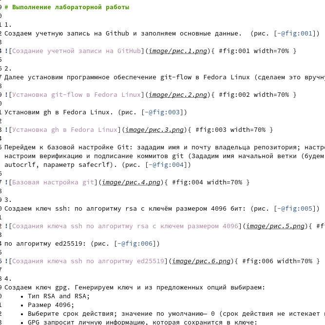
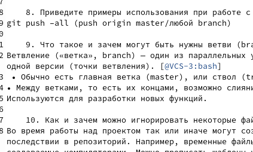

---
## Front matter
title: "Лабораторная работа №2"
subtitle: "Markdown"
author: "Беличева Д.М."

## Generic otions
lang: ru-RU
toc-title: "Содержание"

## Bibliography
bibliography: bib/cite.bib
csl: pandoc/csl/gost-r-7-0-5-2008-numeric.csl

## Pdf output format
toc: true # Table of contents
toc-depth: 2
lof: true # List of figures
lot: false # List of tables
fontsize: 12pt
linestretch: 1.5
papersize: a4
documentclass: scrreprt
## I18n polyglossia
polyglossia-lang:
  name: russian
  options:
	- spelling=modern
	- babelshorthands=true
polyglossia-otherlangs:
  name: english
## I18n babel
babel-lang: russian
babel-otherlangs: english
## Fonts
mainfont: PT Serif
romanfont: PT Serif
sansfont: PT Sans
monofont: PT Mono
mainfontoptions: Ligatures=TeX
romanfontoptions: Ligatures=TeX
sansfontoptions: Ligatures=TeX,Scale=MatchLowercase
monofontoptions: Scale=MatchLowercase,Scale=0.9
## Biblatex
biblatex: true
biblio-style: "gost-numeric"
biblatexoptions:
  - parentracker=true
  - backend=biber
  - hyperref=auto
  - language=auto
  - autolang=other*
  - citestyle=gost-numeric
## Pandoc-crossref LaTeX customization
figureTitle: "Рис."
tableTitle: "Таблица"
listingTitle: "Листинг"
lofTitle: "Список иллюстраций"
lotTitle: "Список таблиц"
lolTitle: "Листинги"
## Misc options
indent: true
header-includes:
  - \usepackage{indentfirst}
  - \usepackage{float} # keep figures where there are in the text
  - \floatplacement{figure}{H} # keep figures where there are in the text
---

# Цель работы

Научиться оформлять отчёты с помощью легковесного языка разметки Markdown.

# Задание

Сделаnm отчёт по предыдущей лабораторной работе в формате Markdown.

# Теоретическое введение

	
Markdown — это облегченный язык разметки с синтаксисом форматирования обычного текста. созданный Джоном Грубером и Аароном Шварцем в 2004 году, сегодня это один из самых популярных языков среди программистов. 
Для записи Markdown можно использовать любой текстовый редактор. Смысл маркдауна в том, что вы делаете разметку своего документа минимальными усилиями, 
а уже какой-то другой плагин или программа превращает вашу разметку в итоговый документ — например в HTML. Но можно и не в HTML, а в PDF или что-нибудь ещё. [@mark:bash]

# Выполнение лабораторной работы

№1
Открыли шаблон лабораторной работы. Изменили неободимые данные в соответсвии с нашей второй лабораторной работой. Изменили название и автора.(рис. [-@fig:001])

{ #fig:001 width=70% } 

Поменяли цель, теоретическое введение и задания на нужные. (рис. [-@fig:002])

{ #fig:002 width=70% } 

№2
Поместили в папку "image" картинки, которые будем использовать. Сделали ссылки на картинки. (рис. [-@fig:003])

{ #fig:003 width=70% } 

№3
Создадим список литературы. Для этого сначала в папке "bib" откроем файл "cite.bib" и в нем создадим по шаблону необходимые нам литературные источники. (рис. [-@fig:004])

{ #fig:004 width=70% } 

Добавим ссылки на источники. (рис. [-@fig:005])

{ #fig:005 width=70% } 

# Выводы

В процессе выполнения этой лабораторной работы я научилась работать с языком разметки Markdown. Познакомилась с базовым синтаксисом Mardown.

# Список литературы{.unnumbered}

::: {#refs}
:::
