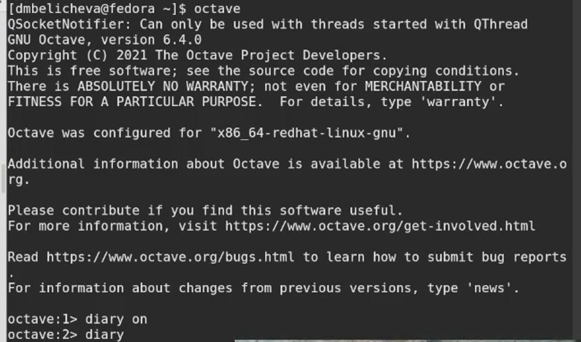
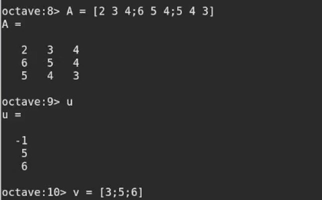
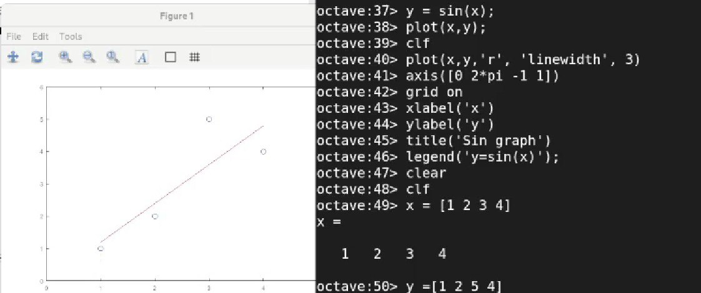
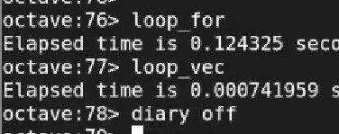

---
## Front matter
lang: ru-RU
title: Лабораторная работа №3
subtitle: Введение в работу с Octave
author:
  - Беличева Д. М.
institute:
  - Российский университет дружбы народов, Москва, Россия
date: 05 декабря 2003

## i18n babel
babel-lang: russian
babel-otherlangs: english

## Formatting pdf
toc: false
toc-title: Содержание
slide_level: 2
aspectratio: 169
section-titles: true
theme: metropolis
header-includes:
 - \metroset{progressbar=frametitle,sectionpage=progressbar,numbering=fraction}
 - '\makeatletter'
 - '\beamer@ignorenonframefalse'
 - '\makeatother'
---

# Информация

## Докладчик

:::::::::::::: {.columns align=center}
::: {.column width="70%"}

  * Беличева Дарья Михайловна
  * студент
  * Российский университет дружбы народов
  * [1032216453@pfur.ru](mailto:1032216453@pfur.ru)
  * <https://dmbelicheva.github.io/ru/>

:::
::: {.column width="25%"}

:::
::::::::::::::

# Вводная часть

## Цель работы

Познакомиться с Octave, изучить основные команды.

## Задание

- Выполнить простейшие операции
- Выполнить операции с векторами
- Вычислить проектор
- Выполнить операции с матрицами
- Построить графики
- Сравнить циклы и операции с векторами

## Основные понятия

GNU Octave — свободная программная система для математических вычислений, использующая совместимый с MATLAB язык высокого уровня.

## Выполнение лабораторной работы

Для начала я установила Octave. Далее запустила его. После выполнила команду для журналирования сессии.

{#fig:001 width=60%}

## Выполнение лабораторной работы

Изучила матрицы и векторы, провела операции над ними.

{#fig:002 width=60%}

## Выполнение лабораторной работы

Построила графики. Изучила команды для изменения цвета графика, подписи осей и создания легенды.

{#fig:003 width=60%}

## Выполнение лабораторной работы

Поработала с циклами и завершила журналирование сессии.

{#fig:004 width=70%}

## Выводы

В процессе выполнения лабораторной работы я познакомилась с Octave и освоила основные команды для работы с ним.

## Список литературы

1. GNU Octave [Электронный ресурс]. 2023. URL: https://ru.wikipedia.org/wiki/GNU_Octave.

