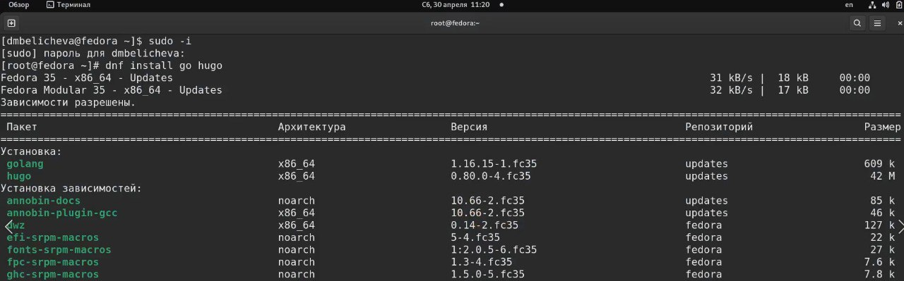
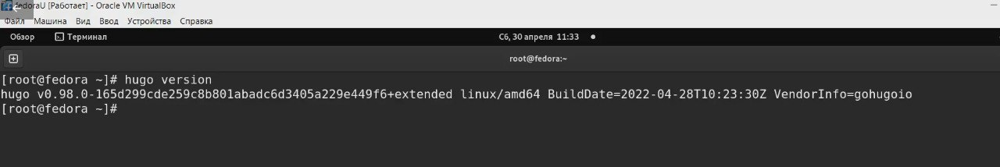
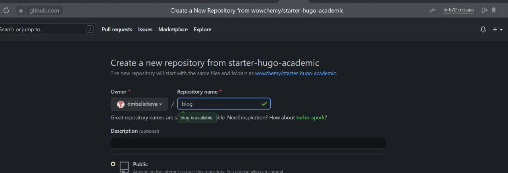
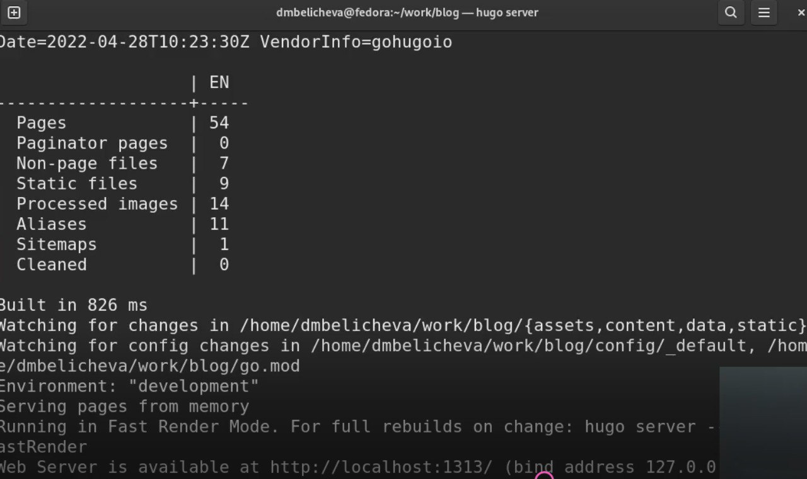
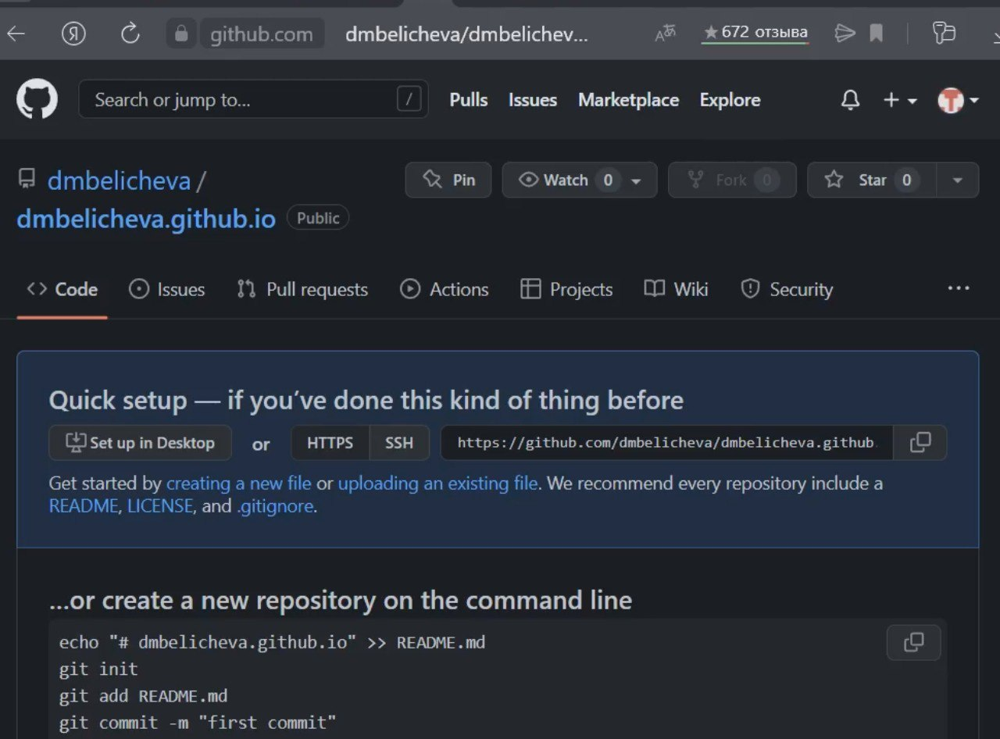
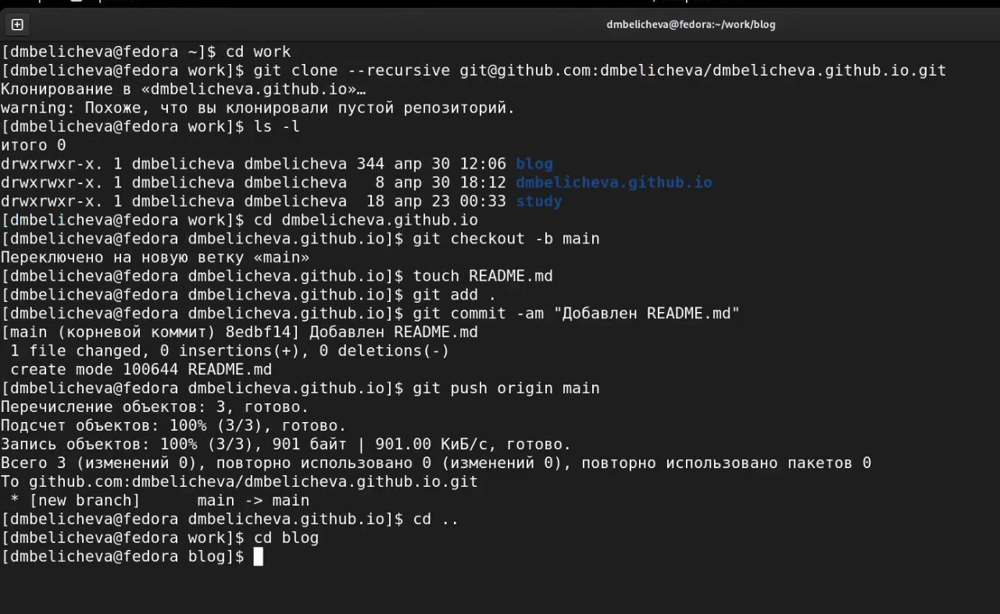
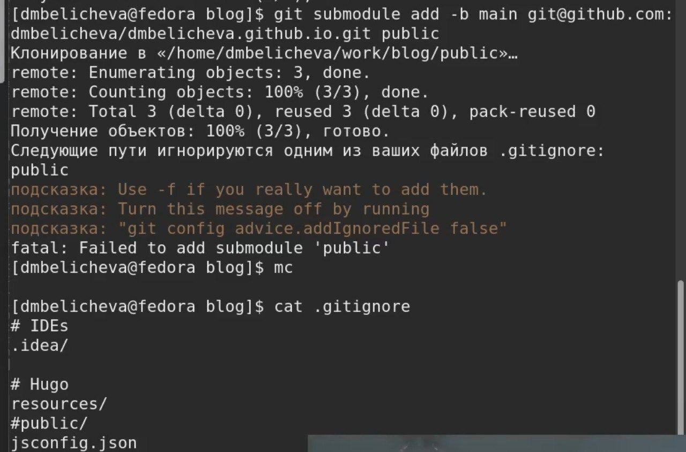
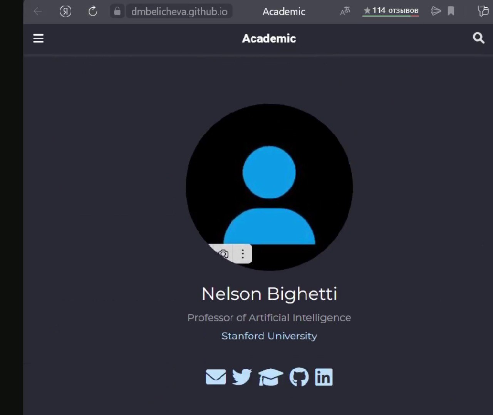

---
## Front matter
lang: ru-RU
title: Первый этап индивидуального проекта. Создание сайта
author:
  - Беличева Д. М.
institute:
  - Российский университет дружбы народов, Москва, Россия
date: 05 декабря 2003

## i18n babel
babel-lang: russian
babel-otherlangs: english

## Formatting pdf
toc: false
toc-title: Содержание
slide_level: 2
aspectratio: 169
section-titles: true
theme: metropolis
header-includes:
 - \metroset{progressbar=frametitle,sectionpage=progressbar,numbering=fraction}
 - '\makeatletter'
 - '\beamer@ignorenonframefalse'
 - '\makeatother'
---

# Информация

## Докладчик

:::::::::::::: {.columns align=center}
::: {.column width="70%"}

  * Беличева Дарья Михайловна
  * студент
  * Российский университет дружбы народов
  * [1032216453@pfur.ru](mailto:1032216453@pfur.ru)
  * <https://dmbelicheva.github.io/ru/>

:::
::: {.column width="25%"}

:::
::::::::::::::

## Цель работы

Создать сайт на Hugo.

## Задание

1. Установить необходимое программное обеспечение.
2. Скачать шаблон темы сайта.
3. Разместить его на хостинге git.
4. Установить параметр для URLs сайта.
5. Разместить заготовку сайта на Github pages.

## Теоретическое введение

Сайт – это совокупность веб-страниц, объединённых под общим доменом и связанных ссылками, тематикой и дизайнерским оформлением. Мы будем создавать статический сайт, для этого нам понадобится Hugo.
Hugo — генератор статических страниц для интернета.

## Выполнение лабораторной работы

1. Установим необходимое програмное обеспечение. Скачаем Hugo и Go. Скачаем необходимый релиз и положим его в папку /tmp/01. Распакованный файл hugo поместим в usr/local/bin.

{ #fig:001 width=70% }

## Выполнение лабораторной работы

Проверим версию Hugo. 

{ #fig:002 width=70% }

## Выполнение лабораторной работы

2. В качестве шаблона индивидуального сайта используется шаблон Hugo Academic Theme. Переходим по ссылке и создаем репозиторий blog. 

{ #fig:003 width=70% }

## Выполнение лабораторной работы

3. Выполним команду hugo server (создадутся необходимые файлы). Нам предоставят ссылку. Переходя по ней, открывается наш сайт (пока на него можно заходить только с моего компьютера). 

{ #fig:005 width=50% }

## Выполнение лабораторной работы

4. Необходимо создать еще один репозиторий, чтобы наш сайт можно было открывать с любого компьютера. 

{ #fig:006 width=50% }

## Выполнение лабораторной работы

Клонируем наш новый репозиторий. Создаем ветку main. Создаем файл README.md. Добавляем в наш репозиторий. 

{ #fig:007 width=60% }

## Выполнение лабораторной работы

5. Подключаем наш репозиторий к папке public. 

{ #fig:008 width=65% }

## Выполнение лабораторной работы

6. Сайт готов.

{ #fig:010 width=50% }

## Выводы

Научились создавать статические сайты с помощью Hugo.

## Список литературы

1. Командная строка Windows [Электронный ресурс]. URL:
https://foxford.ru/wiki/informatika/komandnaya-stroka-windows.

## {.standout}
Спасибо за внимание
